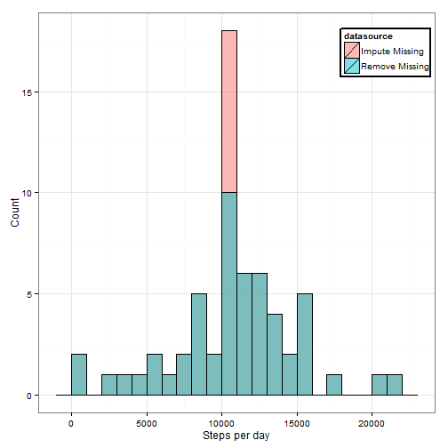
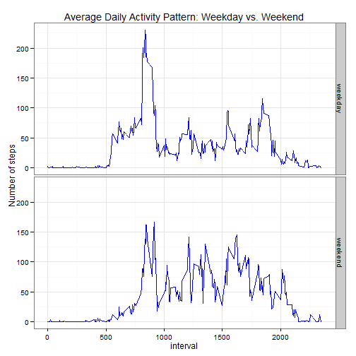

Reproducible Research Peer Assessment 1
========================================================

This markdown file was generated at Sun Jun 15 5:42:15 AM 2014 UTC.

## Introduction

## Set Parameters and Load Data


First the working directory was set


```r
setwd("~/GitHub/RepData_PeerAssessment1-1")
Sys.setlocale("LC_TIME", "English")
require(data.table)
```

```
## Loading required package: data.table
```

```r
require(ggplot2)
```

```
## Loading required package: ggplot2
```

```r
options(scipen = 1, digits = 7)
```


Then, we will load in and preprocess the data.


```r
fileUrl <- "https://d396qusza40orc.cloudfront.net/repdata%2Fdata%2Factivity.zip"
if(!file.exists("activity.csv")){
        download.file(fileUrl, destfile="activity_monitoring_data.zip", 
                      method="auto")       
        unzip("activity_monitoring_data.zip")
}
activityData <- data.table(read.csv("activity.csv",header = TRUE, sep = ",",
        na.strings = "NA", colClasses=c("numeric","Date","numeric")))
```

## What is mean total number of steps taken per day?

Next we will determine what is the mean number of steps taken per day.


```r
transformedDataByDate <- activityData[,list(total=sum(steps)),by=date]
stepsMean <- mean(transformedDataByDate$total,na.rm=TRUE)
stepsMedian <- median(transformedDataByDate$total,na.rm=TRUE)
ggplot(transformedDataByDate, 
        aes(x=total)) + geom_histogram(color="black", fill="white", binwidth = 1000) +  
        geom_vline(aes(xintercept=stepsMedian), color="red", linetype="dashed",
        size=1) + ylim(0, 18) + ggtitle("Total Number of Steps Taken Per Day: Missing Data Ignored") + xlab("Steps per day") + ylab("Count") + theme_bw()
```

 

The mean number of steps taken per day is 10766.1886792.
The median number of steps taken per day is 10765.

## What is the average daily activity pattern?

Next sought to determine the average daily activity pattern.


```r
transformedDataByInterval <- activityData[,list(average=mean(steps,na.rm=TRUE)),
        by=interval]
ggplot(transformedDataByInterval,aes(x=interval,y=average))+ geom_line() + ggtitle("Average Daily Activity Pattern")+ theme_bw()
```

 

```r
maxInterval<-transformedDataByInterval[which.max(transformedDataByInterval$average),
        interval]
```

The 5-minute interval, on average across all the days in the dataset, containing 
the maximum number of steps is 835.

## Determing the effect of imputing missing values


```r
numberNA <- length(is.na(activityData$steps)[is.na(activityData$steps)==TRUE])
imputedActivityData <- activityData
imputedActivityData$steps <- ifelse(is.na(activityData$steps), 
        transformedDataByInterval[match(activityData$interval, 
        transformedDataByInterval$interval),transformedDataByInterval$average], 
        activityData$steps)
```

In the original data set, there exists 2304 missing values in the dataset.
As a result, missing values were imputed by substituting the the mean for that 5-minute interval across all days for the missing value.


```r
transformedImputedDataByDate <- imputedActivityData[,list(total=sum(steps)),
        by=date]
stepsImputedMean <- mean(na.omit(transformedImputedDataByDate$total))
stepsImputedMedian <- median(na.omit(transformedImputedDataByDate$total))
ggplot(transformedImputedDataByDate, aes(x=total)) + geom_histogram(color=
        "black", fill="white",binwidth = 1000) + geom_vline(aes(xintercept=stepsMedian), 
        color="red", linetype="dashed", size=1) + ylim(0, 18) + ggtitle("Total Number of Steps Taken Per Day: Missing Data Imputed") + xlab("Steps per day")+ ylab("Count")  + theme_bw()
```

 

```r
dataHis1 <- transformedDataByDate
dataHis1$datasource <- "Remove Missing"
dataHis2 <- transformedImputedDataByDate
dataHis2$datasource <- "Impute Missing"
dataHisBoth <- rbind(dataHis1,dataHis2)
ggplot(dataHisBoth, aes(x=total, fill=datasource)) + geom_histogram(color="black", binwidth=1000, alpha=.5, position="identity")+ xlab("Steps per day")+ ylab("Count")   + theme_bw() + theme(legend.position = c(0.875, 0.9),legend.background=element_rect(color = "black", size = 1, linetype = "solid"))
```

 

Changes in mean and median as result of imputation were negligible.  For example,
the preimutation mean and median were 10766.1886792 and 10765, 
respectively, while the postimputation mean and median were 10766.1886792
and 10766.1886792 respectively.

If we plot both preimputed and postimputed data together, we can see that the bar in the histogram corresponding to the postion

## Are there differences in activity patterns between weekdays and weekends?

Next, we sought to determine whether differences in the activity pattern existed
between weekdays and weekends.


```r
dataframe <- imputedActivityData
dataframe$weekdayorweekend <- ifelse(weekdays(dataframe$date) %in% c('Saturday',
        'Sunday'),"weekend", "weekday")
SHIT <- dataframe[,list(average=mean(steps)),by=list(interval,
        weekdayorweekend)]
ggplot(SHIT,aes(x=interval,y=average))+ geom_line()+ facet_grid(weekdayorweekend~.) +ggtitle("Average Daily Activity Pattern: Weekday vs. Weekend") + theme_bw()
```

 


