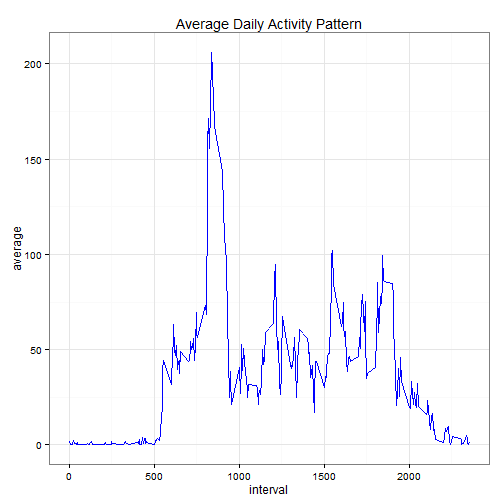
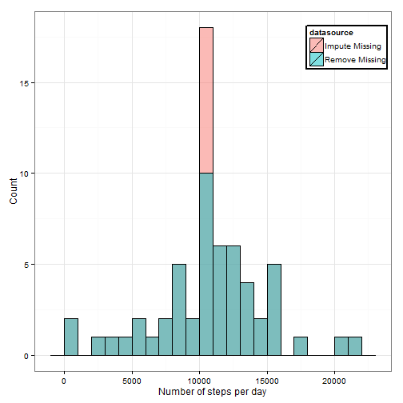
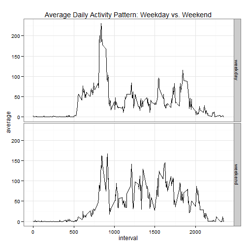

Reproducible Research Peer Assessment 1
========================================================


This code was run on Sun Jun 15 1:31:50 AM 2014 UTC.

First the working directory was set


```r
setwd("~/GitHub/RepData_PeerAssessment1-1")
Sys.setlocale("LC_TIME", "English")
require(data.table)
```

```
## Loading required package: data.table
```

```r
require(ggplot2)
```

```
## Loading required package: ggplot2
```


Then, we will load in and preprocess the data.


```r
fileUrl <- "https://d396qusza40orc.cloudfront.net/repdata%2Fdata%2Factivity.zip"
if(!file.exists("activity.csv")){
        download.file(fileUrl, destfile="activity_monitoring_data.zip", 
                      method="auto")       
        unzip("activity_monitoring_data.zip")
}
activityData <- data.table(read.csv("activity.csv",header = TRUE, sep = ",",
        na.strings = "NA", colClasses=c("numeric","Date","numeric")))
```

Next we will determine what is the mean number of steps taken per day.


```r
transformedDataByDate <- activityData[,list(total=sum(steps)),by=date]
stepsMean <- mean(na.omit(transformedDataByDate$total))
stepsMedian <- median(na.omit(transformedDataByDate$total))
ggplot(transformedDataByDate, aes(x=total)) + geom_histogram(color="black", 
        fill="white") + geom_vline(aes(xintercept=stepsMedian), color="red", 
        linetype="dashed", size=1) + theme_bw()
```

```
## stat_bin: binwidth defaulted to range/30. Use 'binwidth = x' to adjust this.
```

 

The mean number of steps taken per day is 1.0766 &times; 10<sup>4</sup>.
The median number of steps taken per day is 1.0765 &times; 10<sup>4</sup>.

Next sought to determine the average daily activity pattern.


```r
transformedDataByInterval <- activityData[,list(average=mean(steps,na.rm=TRUE)),
        by=interval]
ggplot(transformedDataByInterval,aes(x=interval,y=average))+ geom_line() + theme_bw()
```

 

```r
maxInterval<-transformedDataByInterval[which.max(transformedDataByInterval$average),
        interval]
```

The 5-minute interval, on average across all the days in the dataset, containing 
the maximum number of steps is 835.


```r
numberNA <- length(is.na(activityData$steps)[is.na(activityData$steps)==TRUE])
imputedActivityData <- activityData
imputedActivityData$steps <- ifelse(is.na(activityData$steps), 
        transformedDataByInterval[match(activityData$interval, 
        transformedDataByInterval$interval),transformedDataByInterval$average], 
        activityData$steps)
```

In the original data set, there exists 2304 missing values in the dataset.
As a result, missing values were imputed by substituting the the mean for that 5-minute interval across all days for the missing value.


```r
transformedImputedDataByDate <- imputedActivityData[,list(total=sum(steps)),
        by=date]
stepsImputedMean <- mean(na.omit(transformedImputedDataByDate$total))
stepsImputedMedian <- median(na.omit(transformedImputedDataByDate$total))
ggplot(transformedImputedDataByDate, aes(x=total)) + geom_histogram(color=
        "black", fill="white") + geom_vline(aes(xintercept=stepsMedian), color=
        "red", linetype="dashed", size=1) + theme_bw()
```

```
## stat_bin: binwidth defaulted to range/30. Use 'binwidth = x' to adjust this.
```

 

Changes in mean and median as result of imputation were negligible.  For example,
the preimutation mean and median were 1.0766 &times; 10<sup>4</sup> and 1.0765 &times; 10<sup>4</sup>, 
respectively, while the postimputation mean and median were 1.0766 &times; 10<sup>4</sup>
and 1.0766 &times; 10<sup>4</sup> respectively.

If we plot both preimputed and postimputed data together, we can see that ...


Next, we sought to determine whether differences in the activity pattern existed
between weekdays and weekends.


```r
dataframe <- imputedActivityData
dataframe$weekdayorweekend <- ifelse(weekdays(dataframe$date) %in% c('Saturday',
        'Sunday'),"weekend", "weekday")
SHIT <- dataframe[,list(average=mean(steps)),by=list(interval,
        weekdayorweekend)]
ggplot(SHIT,aes(x=interval,y=average))+ geom_line()+ facet_grid(weekdayorweekend~.) + theme_bw()
```

 


